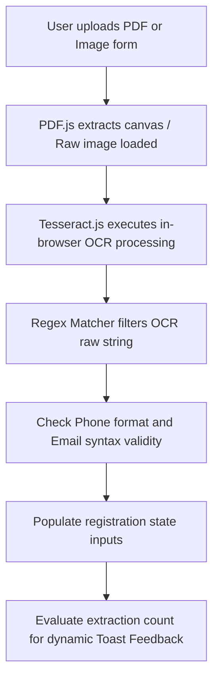
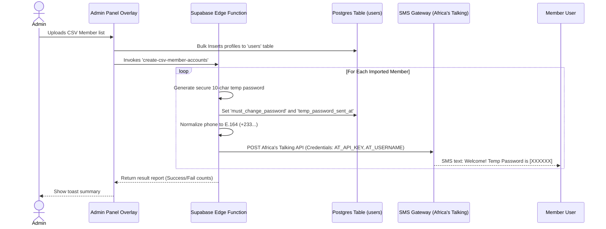

# The Base Movement Platform — Developer & Operations Handoff Master Guide

This guide serves as the definitive reference manual for the incoming development and engineering team. It outlines the architecture, database structures, custom design system, complex operational flows, local development commands, and the frontend migration backlog.

---

## 1. Project Overview & Architectural Vision

The Base Movement is a political and civic mobilization platform designed to organize Ghanaian members at home (the Ghana Network) and across the globe (the Diaspora Network). The platform's slogan, "Ghana First, Jobs for the youth!", guides both user-facing branding and administration interfaces.

### The Three Architectural Surfaces
The application is structured into three distinct layers, routing in lazy-loaded containers in `src/routes.tsx`:
1. **Public Site (`PublicLayout`)**: Static-prerendered, responsive marketing pages, including the homepage manifest, policy aims, global chapter list, merch store, blogs, contact interfaces, and registration pathways.
2. **Member Dashboard (`DashboardLayout`)**: Secured, authenticated workspace where registered members track their status, verify their digital credentials, update profiles, take part in active polls, and engage with local chapters.
3. **Admin Command Center (`AdminLayout`)**: High-fidelity operations center for movement staff, providing real-time growth intelligence, sentiment analyses, geospatial visualisations of members, store inventory tracking, user verifications queue, and system audit logs.

### Technical Stack
*   **Frontend**: React 18 (TypeScript) + Vite 7 + React Router v6.
*   **Build Architecture**: Hybrid Client + SSR (Server-Side Rendering) with static prerendering (`scripts/prerender.mjs`) to ensure SEO-readiness and high speed.
*   **Database & Auth**: Supabase Database (Postgres) + Supabase Auth + Edge Functions.
*   **Styling**: Custom-tailored Vanilla CSS system (defined in `src/index.css`) with strict custom variables, phasing out Tailwind CSS utility and colour configurations for custom elements.
*   **Libraries**: GSAP (micro-animations), Recharts (growth analytics), TinyMCE (rich blog editor), Tesseract.js + PDF.js (in-browser OCR form reader).

---

## 2. Design System & Frontend Governance

The platform uses a custom design system built entirely on custom CSS variables and utility classes. Never use shadcn components or import icons from `lucide-react` in refactored or migrated views.

### 2.1 CSS Brand Variable Tokens (Always use `hsl()`)
All brand elements are defined in `:root` inside `src/index.css`. Never use raw hex codes or Tailwind colour classes.

| Variable Name | HSL Value Reference | Intended Brand Application |
| :--- | :--- | :--- |
| `--primary` | `#006B3F` (Deep Forest Green) | Authority. Primary CTAs, active status, navigation |
| `--accent` | `#DAA520` (Warm Gold) | Prestige. Secondary CTAs, high-value highlights, stat figures |
| `--destructive` | `#CE1126` (Movement Red) | Urgency. Live indicators, negative sentiment flags, low stock |
| `--on-surface` | `#111111` (Charcoal Slate) | Premium legibility. Primary text, solid headers, dark cards |
| `--on-surface-muted` | `#666666` (Muted Grey) | Secondary text, input placeholders, minor metadata label |
| `--border` | Subtle hairline (`hsl(var(--on-surface), 0.08)`) | Borders, dividers, subtle boundaries |
| `--container-low` | `#F8F9FA` (Subtle Warm Tint) | Cards, input backgrounds, table row alternate fills |
| `--surface-warm` | `#FAF8F5` (Warm Cream) | Footer backgrounds, rich narrative section panels |

### 2.2 Authoritative Typography & Dynamic Scaling
The platform operates under a dynamic typography scale governed by the administrative settings:
*   **Primary Fonts**: *Public Sans* & *Work Sans* (locally hosted to guarantee speed and domain independence).
*   **Scale Multipliers**: Controlled by `--font-scale` (for body copy, default `1.0`) and `--font-heading-scale` (for headers, default `1.0`).
*   **Administrative Sliders**: Leadership can adjust typography sizing in real time from the Admin Settings panel. This dynamically updates the database, injecting recalculated CSS rules via `BrandingContext.tsx`'s dynamic `<style>` block:

```css
:root {
  --font-scale: 1.0;
  --font-heading-scale: 1.0;
  
  /* Responsive sizing computed fluidly using CSS clamp() */
  --h1-size: clamp(calc(1.75rem * var(--font-heading-scale)), calc(4.5vw * var(--font-heading-scale)), calc(3.5rem * var(--font-heading-scale)));
  --h2-size: clamp(calc(1.5rem * var(--font-heading-scale)), calc(3.5vw * var(--font-heading-scale)), calc(2.75rem * var(--font-heading-scale)));
  --h3-size: clamp(calc(1.25rem * var(--font-heading-scale)), calc(2.5vw * var(--font-heading-scale)), calc(2rem * var(--font-heading-scale)));
  --p-size: clamp(calc(0.875rem * var(--font-scale)), calc(0.5vw + 0.75rem), calc(1.125rem * var(--font-scale)));
}
```

#### Typography Governance Rules:
1.  **Title Section Anchoring**: Every primary page must start with an authoritative `<h1>` and a **Triple-Pillar Brand Line** immediately below it:
    ```tsx
    import { BrandLine } from '@/components/BrandLine'; // Reusable 3-color line: Red -> Gold -> Green
    ```
2.  **Sentence Case for UI Controls**: Avoid `ALL CAPS` or `Title Case` for buttons, headers, inputs, and form controls. All UI components must use **Sentence case** strictly. Capitalization is allowed only for proper nouns and technical abbreviations (e.g., "MTN Mobile Money", "Movement ID").
3.  **Weight Allocation**: Never use extra black (weight 900) for body blocks. Keep headings to `fontWeight: 800` (Labels/Headings) and body to `fontWeight: 700` (Emphasis) or normal values.

### 2.3 Global Layout Classes & Grid vs. Flexbox Decisions
Predefined layout standards are saved inside `src/index.css`. Keep to the **Layout Guidelines**:
*   **`.desktop-only` / `.mobile-only`**: Hardcoded media queries at `768px` to swap views instantly without heavy JS listeners.
*   **`.sidebar-main` / `.main-sidebar`**: Intrinsic two-column layouts.
*   **`.kpis` / `.panel` / `.ph`**: High-density admin command dashboard grids.
*   **`.footer-grid`**: Mobile-responsive footer structure supporting standard `> * + *` top borders on mobile viewports.

#### Laying out components:
*   **CSS Grid**: Use for two-dimensional, layout-driven, structure-first containers (e.g., fixed forms, dashboard widgets, Recharts containers).
*   **Flexbox**: Use for one-dimensional, content-driven, fluid flows (e.g., header toolbars, centering icons, dynamic list rows, stacking metadata).
*   **Padding clamping**: Spacing between sections must scale fluidly. Standard:
    ```tsx
    style={{ padding: 'clamp(48px, 8vw, 96px) clamp(16px, 4vw, 32px)' }}
    ```

### 2.4 Exclusive Iconography & Interaction Standards
We have completely phased out `lucide-react` in favor of **Material Symbols Outlined** to maintain structural speed and alignment:
```tsx
// Pattern
<span className="material-symbols-outlined" style={{ fontSize: 16 }}>arrow_forward</span>
```
*   **Buttons**: Always use the custom unified `Button` component imported from `@/components/buttons/ui/neon-button` to ensure visual consistency and automatic high-fidelity neon borders.
    *   *Import Example*: `import { Button } from '@/components/buttons/ui/neon-button';`
    *   *Variants*: `primary` (brand green fill with glow), `accent` / `gold` (warm gold fill with glow), `destructive` (brand red fill with glow), `solid` (green fill, hollow on hover), `outline` (hollow, green fill on hover), `default` (inactive tab style), `active-tab` (active tab style), `ghost`, `link`.
    *   *Glow Control*: The high-fidelity neon borders are dynamically managed by leadership settings inside `BrandingContext.tsx` (`settings.button_neon_enabled`). You can manually override this via the `neon` prop: `<Button neon={false}>No Glow</Button>`.
    *   *Sizes*: `sm` (34px), `default` (44px), `lg` (52px), `icon`.
*   **Inputs**: Must always have `boxSizing: 'border-box'` applied to ensure proper scaling within grid items.
*   **Custom Select Dropdowns**: Native `<select>` wrappers must hide browser chevrons (`appearance: 'none'`) and position the custom `<SelIcon />` helper inside `position: 'relative'`.

---

## 3. Database Schema & Persistence

The relational data model is provisioned on a PostgreSQL cluster hosted via Supabase and synced with Supabase client-side interfaces. 

```mermaid
erDiagram
    users ||--o{ comments : "writes"
    updates ||--o{ comments : "receives"
    supplies ||--o{ reviews : "rated_by"
    feedback ||--|{ poll_options : "has"
    users }|--|? ghana_regions : "located_in"
    users }|--|? ghana_constituencies : "belongs_to"

    users {
        uuid id PK
        varchar full_name
        varchar email UNIQUE
        varchar registration_number UNIQUE
        varchar platform "GHANA | DIASPORA"
        varchar country
        varchar phone_number
        varchar gender
        varchar region
        varchar constituency
        varchar chapter
        timestamp joined_at
        varchar status "Active | Approved | Pending | Flagged"
        timestamptz temp_password_sent_at
        boolean must_change_password
    }

    updates {
        uuid id PK
        varchar title
        varchar slug UNIQUE
        text excerpt
        text content
        uuid author_id FK
        varchar category
        timestamp published_at
        text_array tags
    }

    comments {
        uuid id PK
        uuid post_id FK
        varchar author_name
        text content
        timestamp created_at
    }

    supplies {
        uuid id PK
        varchar name
        varchar category
        decimal price_ghs
        integer stock_quantity
        varchar status "In Stock | Low Stock | Out of Stock"
    }

    reviews {
        uuid id PK
        uuid product_id FK
        varchar author_name
        integer rating "1-5"
        text content
    }

    chapters {
        uuid id PK
        varchar name UNIQUE
        varchar city_or_region
        varchar country
        integer member_count
        text description
        text details_url
        varchar status "Active | Inactive"
    }

    feedback {
        uuid id PK
        text question
        varchar status "Active | Closed"
        integer total_votes
    }

    poll_options {
        uuid id PK
        uuid poll_id FK
        varchar label
        integer votes
    }
```

### Column Reference for Key Operational Tables
1.  **`users`**: Central registry of Members. Column status fields control access to the dashboard. `status === 'Active' || status === 'Approved'` maps to the dynamic `isVerified(member)` helper.
2.  **`brand_settings`**: Houses standard primary contact parameters, social channels, and brand colors (`brand_green`, `brand_gold`, `brand_red`).
3.  **`audit_logs`**: High-fidelity logging storing timestamps, operations, and status for accountability.
4.  **`sentiment_analysis`**: Tracks community mood topics (`Topic`, `Score`, `Sentiment`). Used to feed the Admin Engagement Hub.
5.  **`regional_performance`**: Aggregates total member expansion rates per Ghana region.
6.  **`countries`**: Authorized list of dialing prefixes and registration codes.
7.  **Geographic Masters (`ghana_regions` & `ghana_constituencies`)**: Autoritative lookup grids representing the 16 standard regions and 275 electoral constituencies.

---

## 4. Critical Systems & Pipelines

### 4.1 Offline Scanned Form OCR Pipeline
To accommodate members registration in remote settings, the system includes an in-browser handwriting scanner.



#### OCR Validation and Safe Mitigation:
*   **Zero-cost constraint**: Built strictly using `Tesseract.js` to run in-browser. This avoids expensive external APIs (Google Cloud Vision/Azure AI) as per financial rules.
*   **Toast Safeguards**:
    *   *0 fields read*: "Nothing could be read — please fill in your details manually." (Orange warning)
    *   *1–3 fields*: "Partially read — please review and complete the remaining fields." (Blue info)
    *   *4+ fields*: "Form scanned — please review and complete your details." (Green success)
*   **Sanitization Filters**: Extracted numbers with fewer than 7 digits are discarded. Emails are verified via standard character sets. Crucially, scanned forms are **never auto-submitted**. They are displayed in the form fields for final user review.

---

### 4.2 Bulk CSV Importing & SMS Authentication Pipeline
When offline registration forms are gathered in bulk, administrators can upload a CSV to import hundreds of members. This triggers an account creation pipeline so they can log in without emails.



#### Key Implementation & Security Details:
1.  **Secure Password Generation**: Generated on the server using `crypto.getRandomValues`. It omits confusing character sequences (`0`, `O`, `1`, `l`, `I`) to prevent SMS readability issues.
2.  **Supabase Auth Creation**: Executed on the backend via a secure Supabase Edge Function using `auth.admin.createUser()` with the administrative service role key.
3.  **Ghana Number Normalization Helper**:
    ```ts
    function toE164Ghana(raw: string): string {
      const digits = raw.replace(/\D/g, '');
      if (digits.startsWith('233')) return `+${digits}`;
      if (digits.startsWith('0')) return `+233${digits.slice(1)}`;
      return `+233${digits}`;
    }
    ```
4.  **First-Login Redirect Guard**: When a user logs in, the `DashboardLayout` checks the metadata. If `must_change_password: true` is found, the system blocks dashboard access and redirects the user to `/dashboard/change-password` to update their password.
5.  **Forgot Password (Phone OTP Flow)**: Members without email addresses use a phone OTP flow. The system generates a 6-digit OTP, stores it with a 10-minute expiry in `password_reset_otps`, and sends it via SMS. The user inputs the code to set their new password.

---

### 4.3 Command Center Intelligence Suite
*   **Growth Intelligence**: Uses Recharts to show active member gains over time, highlighting performance metrics.
*   **Sentiment Pulse (Sentiment Analysis)**: Monitors community trust levels. Topics marked in deep red (Negative Sentiment) highlight areas that require immediate regional communication support.
*   **System Audit Vault**: Transparently logs administrative actions and records them in a secure Postgres database to monitor access.

---

## 5. Development Operations & Commands

### 5.1 Local Environment Setup
To configure the project locally, duplicate `.env.example` as `.env` and configure your keys:
```bash
# Core Environment Keys
VITE_SUPABASE_URL=your_supabase_url
VITE_SUPABASE_ANON_KEY=your_supabase_anon_key
VITE_TINYMCE_API_KEY=your_tinymce_rich_editor_key
```

### 5.2 Key CLI Script Reference
Run these commands from the root directory:

| Operations Target | Command Line Script | Expected Process / Results |
| :--- | :--- | :--- |
| **Development Server** | `npm run dev` | Runs the Vite dev server with increased Node memory limit allocation. |
| **Complete System Build** | `npm run build` | Builds the client bundle, compiles the server bundle, and runs static prerendering (`scripts/prerender.mjs`). |
| **Direct Client Compile** | `npm run build:client` | Runs TypeScript check (`tsc -b`) and bundles client assets via Vite. |
| **Direct Server SSR Compile** | `npm run build:server` | Bundles server assets (`src/entry-server.tsx`) to `dist/server`. |
| **Verify Type Safety** | `npm run typecheck` | Compiles codebase in strict mode (`tsc -b --noEmit`) to verify TS compliance. |
| **Run Unit Tests** | `npm run test` | Runs the Vitest test suite. |
| **Eslint Static Analysis** | `npm run lint` | Runs ESLint rules across the project. |

### 5.3 Database & Migration Scripts
*   `node scripts/check-tables.js`: Validates the connection to the Supabase DB.
*   `psql -h host -U user -d db -f scripts/create-plan-pillars.sql`: Seeds policy pillars into the database.
*   `npm run prepare`: Configures Husky hooks to run pre-commit hooks (`lint-staged`).

---

## 6. Frontend Migration Backlog & Handoff Checklist

### 6.1 Migration Work Completed (Do Not Modify)
*   `src/components/Navbar.tsx`: Migrated. Removed Lucide and neon-buttons. Uses the custom mobile drawer and dropdown selectors.
*   `src/components/Footer.tsx`: Migrated. Uses the `.footer-grid` structure with top borders on mobile.
*   `src/pages/Home.tsx`: Migrated. Uses `clamp()` responsive headers, fetches dynamic milestones, chapters, and active polls via `adminService.ts`, and includes mobile-responsive column structures.
*   `src/pages/ProfileSettings.tsx`: Migrated. Uses `.profile-page` and custom inputs, including the `<SelIcon />` helper.
*   `src/components/layouts/AdminLayout.tsx`: Migrated. Replaced shadcn overlays with native state controls.

---

### 6.2 Frontend Migration Backlog (Incoming Team Agenda)
The following public-facing pages still contain legacy Tailwind colors, Lucide imports, or neon-button references. Migrate them using the instructions below:

#### 1. Blog Pages (`src/pages/Blog.tsx` & `src/pages/BlogPost.tsx`)
*   **Task**: Remove `ArrowRight`, `Loader2`, and `Newspaper` from `lucide-react`. Replace them with `arrow_forward`, `sync`, and `newspaper` from **Material Symbols Outlined**.
*   **Design**: Update filters to use brand CSS colors. Set the main title font to `font-size: clamp(32px, 8vw, 64px)` with a `BrandLine` anchor.
*   **Mobile**: Ensure the post cards layout uses a responsive grid layout. Add `aspect-ratio: 16/9` to article preview headers to prevent text wrapping on mobile screens.

#### 2. Our Agenda (`src/pages/OurAgenda.tsx`)
*   **Task**: Replace `GraduationCap`, `Building2`, `Factory`, `Construction`, `Landmark`, `Sprout`, and `ArrowRight` with their Material Symbols equivalents (`school`, `apartment`, `factory`, `construction`, `account_balance`, `eco`, `arrow_forward`).
*   **Design**: Standardize the six aims card deck to use `--container-low` background fills and gold borders.
*   **Mobile**: Verify that list elements stack vertically on screens under `768px`. Set interactive tab targets to a minimum height of `44px`.

#### 3. Contact (`src/pages/Contact.tsx`)
*   **Task**: Replace `Mail`, `Phone`, `MapPin`, and `Send` with `mail`, `call`, `location_on`, and `send` Material Symbols.
*   **Design**: Use the unified `Button` component with variant `primary` (`hsl(var(--primary))`) for form submission, ensuring the design system's consistent hover and glow effects.
*   **Mobile**: Stack the contact details card and form vertically on mobile layouts. Set inputs to a minimum height of `44px` with `boxSizing: 'border-box'` to prevent layout issues.

#### 4. Donate (`src/pages/Donate.tsx` & sub-components)
*   **Task**: Remove `Heart` and `Check` Lucide imports. Check all sub-components in `src/pages/donate/components/` to ensure they use the standard `Button` component from `@/components/buttons/ui/neon-button`.
*   **Design**: Set pricing selector pills to use `hsl(var(--primary))` and `hsl(var(--accent))` values.
*   **Mobile**: Grid options must stack cleanly. Set the pricing grid layout to a 2-column view on mobile screens (avoid a single-column layout here to keep the pricing choices compact).

#### 5. Secondary Pages Backlog (Chapters, Impact, Login, Register, Supplies)
*   **Task**: Scan files for `lucide-react` and replace them with standard inline elements and Material Symbol spans. Standardize all buttons to use the custom unified `Button` component (`@/components/buttons/ui/neon-button`).
*   **Mobile Grids**: Update columns using the standard responsive pattern:
    ```css
    /* Define in index.css to ensure responsive grid scaling */
    .responsive-grid {
      display: grid;
      grid-template-columns: repeat(3, 1fr);
      gap: 24px;
    }
    @media (max-width: 768px) {
      .responsive-grid {
        grid-template-columns: 1fr !important;
      }
    }
    ```

---

### 6.3 Handoff QA & Verification Checklist
Before deploying new code or marking pages as complete, verify that the implementation meets these standards:

- [ ] **Zero Lucide Imports**: The build contains no references to `lucide-react`. All icons are rendered via Material Symbols Outlined.
- [ ] **Standardized Button Component**: All interactive buttons are implemented using the custom unified `Button` component from `@/components/buttons/ui/neon-button` (no raw `<button>` elements with ad-hoc styling).
- [ ] **No Tailwind Colors**: Code contains no utility classes like `text-brand-green`, `bg-stone-50`, or `border-slate-200`. Use custom CSS variables with `hsl()` instead.
- [ ] **Fluid Typography**: Large headings use `clamp()` scaling. Sub-labels are organized within H1-H4 structural scopes.
- [ ] **Form Safety**: Form elements use `boxSizing: 'border-box'` and inputs are at least `44px` tall for touch targets.
- [ ] **Mobile Validation**: Layouts render correctly on mobile widths (`320px` to `768px`). There are no horizontal scrollbars.
- [ ] **TypeScript Compile**: The TypeScript compiler returns no errors:
    ```bash
    npm run typecheck
    ```
- [ ] **Build Prerendering**: Production build succeeds and generates prerendered static assets:
    ```bash
    npm run build
    ```

---

*“The Base Movement — Absolute Integrity. Built for member action. Ghana First!”*
